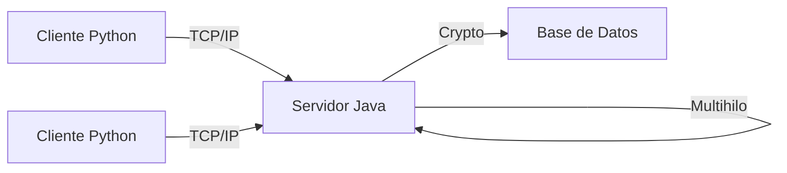

# Proyecto-Chat
# Chat Empresarial PSP46

**Autor:** Jorge Rivera Pozuelo  
**GitHub:** [@JorgeRiveraPozuelo](https://github.com/JorgeRiveraPozuelo)

---

## Descripción

Sistema de chat empresarial cliente-servidor con comunicación en tiempo real utilizando Python y Java sobre TCP/IP con cifrado de mensajes.

---

## Arquitectura


**Cliente:** Python + Sockets + Qt Designer  
**Servidor:** Java + Multihilo + Cifrado  
**Protocolo:** TCP/IP

---

## Características

- Envío y recepción de mensajes en tiempo real
- Edición de mensajes 
- Cifrado de comunicaciones
- Soporte multihilo para múltiples clientes
- Registro timestamp de mensajes
- Envío de documentos y fotos
- Sistema de búsqueda de mensajes
- Soporte para grupos 

---

## Tecnologías

| Componente | Tecnología |
| :--- | :--- |
| Cliente | Python, PyQt5, Sockets |
| Servidor | Java, Multithreading |
| Seguridad | Cryptography |
| Base de Datos | Sistema de archivos |

---

## Instalación

### Servidor (Java)
```bash
javac ServidorChat.java
java ServidorChat
```

### Cliente (Python)
```bash
pip install socket cryptography PyQt5
python cliente_chat.py
```

---

## Estructura del Proyecto
```
Desarrollo-De-Interfaces/
├── cliente/
│   ├── cliente_chat.py
│   └── interfaz.ui
├── servidor/
│   └── ServidorChat.java
└── README.md
```

---

## Estado del Proyecto

**En desarrollo** - Enero 2026

---
